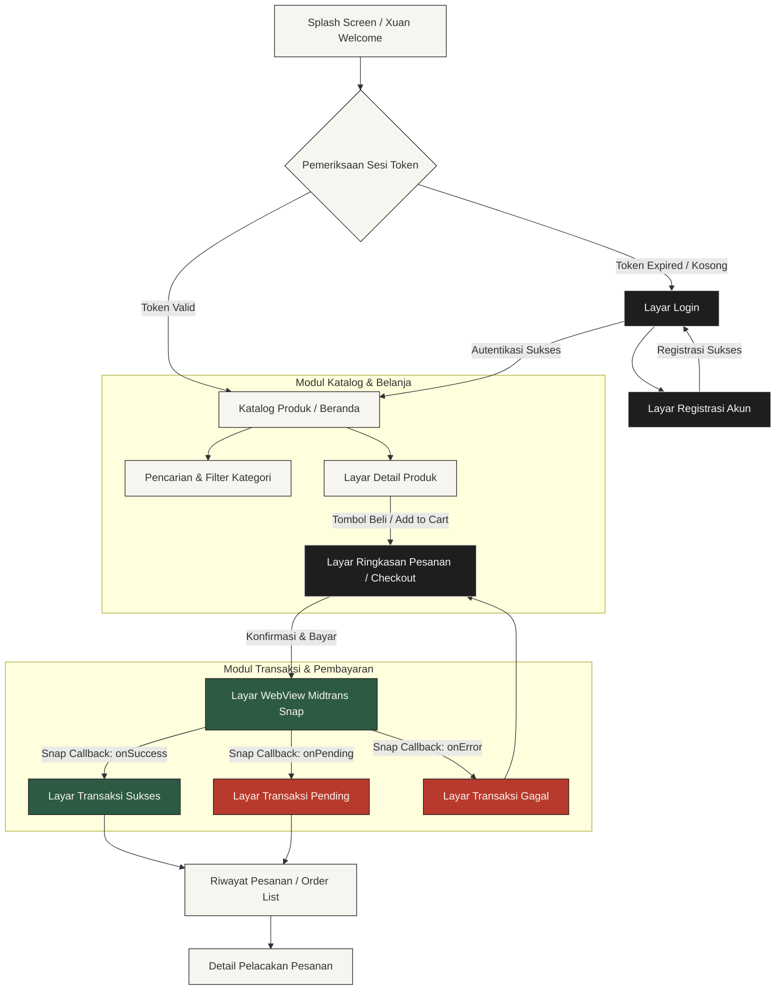

# 🎨 PRD Addendum — Sistem Desain Huashu & UX Flow Aplikasi Flutter

---

## 1. Filosofi Estetika Huashu Design (华书设计)

**Huashu Design** adalah konsep desain antarmuka modern yang terinspirasi dari esensi seni tradisional lukisan cat air (water-ink / 水墨) dan kaligrafi Asia Timur, yang dikombinasikan dengan kegunaan digital modern yang bersih. Filosofi utama sistem desain ini adalah menyajikan ketenangan visual, kejelasan fungsi, dan kekuatan karakter artistik.

Sistem desain ini menerapkan aturan **"Anti-AI Design Slop"** dengan menolak pola-pola generik generator visual otomatis:
*   ❌ **Banned Elements**: Tidak menggunakan gradasi neon ungu-biru, tidak memakai sudut kartu membulat ekstrem (bulat 20px-30px), tidak menempatkan bayangan mengambang tebal (heavy floating shadows), dan menghindari ikon emoji berwarna-warni yang merusak keanggunan layout.
*   ✅ **Emphasized Elements**: Struktur grid garis 0.5dp yang presisi, pemanfaatan ruang kosong (negative space) yang proporsional, kombinasi harmonis tipografi serif klasik untuk judul dan sans-serif geometris untuk teks isi, serta sapuan kuas halus (ink brush divider) sebagai aksen struktural.

---

## 2. Sistem Token Visual (Visual Design Tokens)

### 2.1 Palet Warna Mineral Tradisional (Mineral Ink Colors)

Warna-warna dalam Huashu Design merujuk pada pigmen mineral alami dan media tulis klasik:

| Token Warna | Nilai Heksadesimal | Peran Antarmuka | Deskripsi Estetika |
| :--- | :--- | :--- | :--- |
| **Xuan Paper Background** | `#F7F5F0` | Latar belakang aplikasi utama | Putih gading hangat dengan tekstur halus menyerupai serat kertas tradisional Xuan. |
| **Charcoal Ink Black** | `#1E1E1E` | Tipografi utama, teks judul, border | Hitam arang lembut yang kontras namun tidak tajam di mata, memberi kesan tinta tulisan. |
| **Mineral Jade Green** | `#2D5A43` | Warna primer, tombol aktif, status sukses | Hijau batu giok yang melambangkan kemakmuran, harmoni, dan integritas. |
| **Stained Cinnabar Red** | `#B83A2C` | Warna sekunder, harga produk, stempel status, error | Merah bubuk sinabar tradisional, digunakan untuk penegasan harga dan stempel otentikasi. |
| **Light Ink Line** | `#E2DFD5` | Border, garis pembatas grid, ikon non-aktif | Abu-abu kecokelatan sangat tipis, merepresentasikan sapuan air tinta encer. |

### 2.2 Sistem Tipografi (Typography Hierarchy)

Mengatur ritme baca visual dengan memadukan font Serif klasik (untuk judul) dan Sans-Serif modern (untuk teks detail):

*   **Judul Utama / Hero Heading (`H1`)**: Noto Serif SC / Playfair Display. Font Serif tebal, spasi rapat. Menciptakan impresi puitis seperti bait puisi klasik.
*   **Judul Sekunder (`H2`, `H3`)**: Noto Serif SC. Ukuran sedang, digunakan untuk header bagian dan sub-kategori produk.
*   **Teks Isi / Body Text (`Body1`, `Body2`)**: Inter / Noto Sans SC. Sans-Serif bersih, spasi baris longgar (`line-height: 1.6`) untuk kenyamanan membaca di layar kecil.
*   **Aksen Kecil / Caption**: Inter (Medium, All-caps, spasi karakter lebar). Digunakan untuk label status, tanggal, dan informasi sekunder penjual.

### 2.3 Bentuk, Border & Pembatas (Shapes & Lines)
*   **Sudut Elemen (Radius)**: Konsisten pada **0px** (sudut tajam persegi klasik) hingga maksimal **4px** untuk elemen interaktif seperti tombol. Ini menolak bentuk bulat melingkar yang kekanak-kanakan.
*   **Pembatas Grid**: Garis solid ultra-tipis dengan ketebalan **0.5dp** menggunakan warna `Light Ink Line` (`#E2DFD5`).
*   **Aksen Stempel (Seal Anchor)**: Tombol utama atau elemen penanda khusus diberi dekorasi garis bingkai ganda tipis menyerupai stempel merah segel batu (traditional seal emblem).

---

## 3. Diagram Alur Navigasi Pengguna (UX Navigation Map)

Berikut adalah peta perjalanan pengguna (User Journey Map) dari pintu masuk autentikasi hingga penyelesaian transaksi Midtrans Snap:

---

## 4. Spesifikasi Halaman Antarmuka (Screen Specifications)

### 4.1 Halaman Autentikasi (Login & Register)
*   **Tata Letak**: Minimalis vertikal. Bidang input berupa garis bawah tipis (`underline-only style` dengan warna `#1E1E1E`), tanpa kotak input tertutup.
*   **Elemen Estetika**: Judul halaman menggunakan font serif berukuran besar di bagian atas kiri. Logo aplikasi berupa huruf kaligrafi bergaya stempel merah (`#B83A2C`) di sudut kanan atas.
*   **Tombol Aksi**: Tombol persegi panjang tanpa border radius, warna latar `Charcoal Ink Black` dengan teks putih gading Xuan.

### 4.2 Halaman Beranda & Katalog Produk (Catalog)
*   **Tata Letak**: Tampilan daftar produk menggunakan tata letak grid asimetris (dua kolom dengan tinggi baris bervariasi secara bergantian / staggered grid) untuk memberikan kesan dinamis alami seperti lukisan lanskap.
*   **Desain Kartu Produk**: Tanpa background berwarna pada kartu, produk menyatu langsung dengan latar Xuan Paper. Pemisahan antar produk menggunakan garis tipis `Light Ink Line` `#E2DFD5` ketebalan 0.5px.
*   **Elemen Teks**: Nama produk menggunakan font sans-serif tebal berwarna `#1E1E1E`. Harga ditekankan menggunakan font serif klasik berwarna merah sinabar `#B83A2C`.

### 4.3 Halaman Detail Produk
*   **Tata Letak**: Header gambar produk berukuran besar di bagian atas (aspek rasio 1:1) dengan bingkai tipis ganda. Informasi produk berada di bagian bawah yang dapat digulirkan (scrollable sheet).
*   **Aksen Huashu**: Pembatas antara informasi penjual dan detail deskripsi menggunakan widget `InkBrushDivider` (sapuan kuas digital dinamis).
*   **Tombol Pembelian**: Tombol checkout di bagian bawah layar menempel penuh (full-width sticky button) berwarna `Mineral Jade Green` (`#2D5A43`), melambangkan keputusan transaksi yang aman dan harmonis.

### 4.4 Halaman Checkout & Snap WebView
*   **Layar Checkout**: Menyusun alamat penerima dalam kotak berbingkai tipis ganda menyerupai amplop surat tradisional. Daftar barang belanja ditumpuk vertikal dengan pemisah garis putus-putus abu-abu arang.
*   **Layar Midtrans Snap WebView**: Halaman WebView memuat Snap API secara utuh. Area atas layar dihiasi header navigasi berlatar `#F7F5F0` dengan teks "Penyelesaian Transaksi" untuk menjaga konsistensi visual aplikasi meskipun sedang memuat halaman gateway luar.
*   **Layar Hasil Transaksi**:
    *   *Sukses*: Menampilkan ikon lingkaran giok besar (`#2D5A43`) dengan ilustrasi garis minimalis, diikuti teks kaligrafis "Pembayaran Diterima dengan Baik".
    *   *Gagal*: Menampilkan stempel segel merah sinabar bergambar karakter silang tipis, memberikan kesan resmi tanpa menimbulkan kepanikan visual pembeli.
