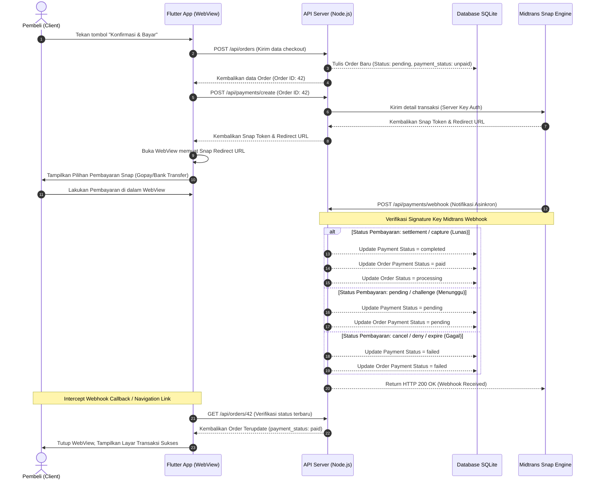

# 🔌 SRS Addendum — Kontrak API & Siklus Hidup Transaksi Midtrans

---

## 1. Pemetaan Kontrak API (API Interface Contracts)

*   **Base URL**: `https://d04a-2404-c0-b301-8af6-a587-34e-b9b3-3cba.ngrok-free.app`
*   **Format Response Global**:
    ```json
    {
      "success": true,
      "message": "Pesan deskriptif dari server",
      "data": { ... }
    }
    ```

### 1.1 Modul Autentikasi (Authentication Contracts)

#### A. POST `/api/auth/register` (Public)
*   **Content-Type**: `application/json`
*   **Request Body**:
    ```json
    {
      "email": "customer@huashu.com",
      "name": "Budi Santoso",
      "password": "password123",
      "passwordConfirm": "password123"
    }
    ```
*   **Response Sukses (201 Created)**:
    ```json
    {
      "success": true,
      "message": "Registrasi berhasil",
      "data": {
        "id": 10,
        "email": "customer@huashu.com",
        "name": "Budi Santoso",
        "role": "customer",
        "is_active": true,
        "created_at": "2026-05-28T05:00:00.000Z"
      }
    }
    ```

#### B. POST `/api/auth/login` (Public)
*   **Content-Type**: `application/json`
*   **Request Body**:
    ```json
    {
      "email": "customer@huashu.com",
      "password": "password123"
    }
    ```
*   **Response Sukses (200 OK)**:
    ```json
    {
      "success": true,
      "message": "Login berhasil",
      "data": {
        "id": 10,
        "email": "customer@huashu.com",
        "name": "Budi Santoso",
        "role": "customer",
        "token": "eyJhbGciOiJIUzI1NiIs...",
        "refresh_token": "eyJhbGciOiJIUzI1NiIs..."
      }
    }
    ```

#### C. POST `/api/auth/refresh-token` (Public)
*   **Content-Type**: `application/json`
*   **Request Body**:
    ```json
    {
      "refresh_token": "eyJhbGciOiJIUzI1NiIs..."
    }
    ```
*   **Response Sukses (200 OK)**:
    ```json
    {
      "success": true,
      "message": "Token berhasil diperbarui",
      "data": {
        "token": "eyJhbGciOiJIUzI1NiIs..."
      }
    }
    ```

---

### 1.2 Modul Katalog Produk (Product Contracts)

#### D. GET `/api/products` (Protected)
*   **Header**: `Authorization: Bearer <access_token>`
*   **Query Parameters**:
    *   `page`: number (default: `1`)
    *   `limit`: number (default: `10`)
    *   `category`: string (opsional, filter kategori)
    *   `search`: string (opsional, pencarian nama)
    *   `minPrice` / `maxPrice`: number (opsional, rentang harga)
*   **Response Sukses (200 OK)**:
    ```json
    {
      "success": true,
      "message": "Berhasil mengambil data produk",
      "data": [
        {
          "id": 1,
          "name": "Teh Hijau Batu Giok",
          "description": "Teh hijau organik premium dari pegunungan tinggi.",
          "price": "Rp 150.000",
          "stock": 45,
          "category": "Minuman",
          "image_url": "https://d04a-2404-c0-b301-8af6-a587-34e-b9b3-3cba.ngrok-free.app/public/products/image-1716700800.png",
          "seller_id": 2,
          "is_active": true
        }
      ],
      "pagination": {
        "total": 1,
        "page": 1,
        "limit": 10,
        "totalPages": 1
      }
    }
    ```

#### E. POST `/api/products/create` (Protected, Khusus Seller)
*   **Header**: `Authorization: Bearer <access_token>`
*   **Content-Type**: `multipart/form-data`
*   **Request Body (form-data)**:
    *   `name`: "Cangkir Teh Keramik Xuan" (string)
    *   `description`: "Cangkir keramik buatan tangan dengan estetika guratan tinta." (string)
    *   `price`: `250000` (number)
    *   `stock`: `15` (number)
    *   `category`: "Peralatan Rumah" (string)
    *   `image_url`: `<File Gambar>` (file binary)
*   **Response Sukses (201 Created)**:
    ```json
    {
      "success": true,
      "message": "Produk berhasil dibuat",
      "data": {
        "id": 5,
        "name": "Cangkir Teh Keramik Xuan",
        "description": "Cangkir keramik buatan tangan...",
        "price": "Rp 250.000",
        "stock": 15,
        "category": "Peralatan Rumah",
        "image_url": "https://d04a-2404-c0-b301-8af6-a587-34e-b9b3-3cba.ngrok-free.app/public/products/image-xuan.png"
      }
    }
    ```

---

### 1.3 Modul Pemesanan & Pembayaran (Orders & Payments)

#### F. POST `/api/orders` (Protected)
*   **Header**: `Authorization: Bearer <access_token>`
*   **Content-Type**: `application/json`
*   **Request Body**:
    ```json
    {
      "total_amount": 400000,
      "shipping_address": {
        "nama_penerima": "Budi Santoso",
        "nomor_hp": "081234567890",
        "jalan": "Jl. Kemerdekaan No. 45",
        "kota": "Jakarta Selatan",
        "provinsi": "DKI Jakarta",
        "kode_pos": "12345"
      },
      "notes": "Tolong dipak dengan kertas pelindung tebal",
      "items": [
        {
          "product_id": 1,
          "quantity": 1,
          "price": 150000
        },
        {
          "product_id": 5,
          "quantity": 1,
          "price": 250000
        }
      ]
    }
    ```
*   **Response Sukses (201 Created)**:
    ```json
    {
      "success": true,
      "message": "Pesanan berhasil dibuat",
      "data": {
        "id": 42,
        "user_id": 10,
        "status": "pending",
        "payment_status": "unpaid",
        "total_amount": "Rp 400.000"
      }
    }
    ```

#### G. POST `/api/payments/create` (Protected)
*   **Header**: `Authorization: Bearer <access_token>`
*   **Request Body**:
    ```json
    {
      "order_id": 42
    }
    ```
*   **Response Sukses (200 OK)**:
    ```json
    {
      "success": true,
      "message": "Berhasil mendapatkan token pembayaran",
      "data": {
        "token": "66e4fa55-fdac-4ef9-91b5-733b97d1b862",
        "redirect_url": "https://app.sandbox.midtrans.com/snap/v4/redirection/66e4fa55-fdac-4ef9-91b5-733b97d1b862"
      }
    }
    ```

---

## 2. Diagram Siklus Hidup Pembayaran Midtrans Snap (Sequence Architecture)

Berikut adalah urutan transaksi lengkap dari inisiasi pesanan oleh client Flutter hingga sinkronisasi pembayaran menggunakan Webhook Midtrans:



---

## 3. Aturan Webhook & Mapping Status Transaksi

Server backend akan memproses webhook dari Midtrans secara otomatis. Di sisi client Flutter, status transaksi dipetakan dari API response `/api/orders/:id` untuk menentukan visualisasi antarmuka:

| Response `payment_status` (API) | Status Pesanan (`status`) | Visual Antarmuka Klien (Huashu Design Representation) |
| :--- | :--- | :--- |
| **`paid`** | `processing` | **Layar Transaksi Sukses**: Menggunakan bingkai batu giok hijau `#2D5A43`, menampilkan ilustrasi minimalis "Selesai" dan tombol untuk memantau status pesanan. |
| **`pending`** | `pending` | **Layar Pembayaran Tertunda**: Kotak amplop abu-abu dengan detil kode pembayaran / virtual account, tombol untuk menyalin nomor rekening transfer. |
| **`failed`** | `pending` | **Dialog Pembayaran Gagal**: Layar checkout diaktifkan kembali dengan popup stempel segel merah sinabar `#B83A2C` bertuliskan "Pembayaran Ditolak". |
| **`unpaid`** | `pending` | **Layar Checkout Aktif**: WebView ditutup prematur oleh pengguna, menampilkan kembali halaman Checkout agar user bisa mencoba kembali. |
