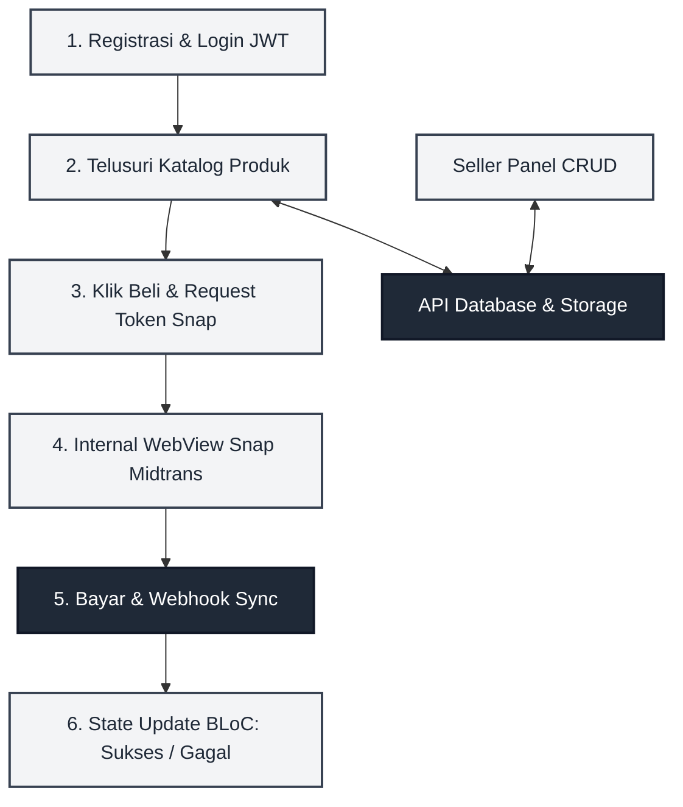

# DESAIN POSTER 1: Cara Kerja Aplikasi (System Flow & Mechanics)

**Catatan untuk Desainer (Fathur Rohman):**
*Gunakan ukuran kanvas/kertas **A3 (29.7 x 42 cm)**. Desain poster ini difokuskan untuk menjelaskan **Cara Kerja Aplikasi** secara teknis dan runtut. Bagian tengah berisi diagram alir (flowchart) interaktif. Gunakan gaya desain visual yang bersih dengan latar belakang Xuan Paper (off-white) dan ornamen tinta arang khas Huashu. Semua teks di bawah ini dapat di-copy-paste langsung ke teks box di Canva/Figma.*

---

## [Bagian Header]
**Judul Besar:** Alur Mekanisme & Cara Kerja Huashu Marketplace
**Sub-judul:** Panduan Teknis Arsitektur Alur Transaksi, Otentikasi JWT, dan Manajemen Inventori Seller
**Oleh:** Ervareza Naurian (24.01.53.0018), Adrianus Bagus (24.01.53.0033)

---

## [Bagian Tengah - Elemen Visual Utama: Diagram Alur Cara Kerja]
*(Gambarkan kembali diagram alur sistem ini secara visual dengan ikon-ikon yang menarik di Canva/Figma)*

---

## [Bagian Kiri - Manajemen Sesi & Autentikasi (JWT Flow)]

### 1. Registrasi & Otorisasi Sesi Aman
*   **Registrasi Satu Langkah:** Pengguna baru mendaftar langsung sebagai `customer` menggunakan email unik dan password terenkripsi.
*   **Dual-Role Access Token:** Payload JWT (`access_token`) memuat informasi hak akses pengguna. Akun customer secara otomatis memiliki otoritas untuk membuka *Seller Panel* tanpa harus melakukan registrasi akun baru.
*   **Silent Token Refresh:** Aplikasi mendeteksi masa aktif token (7 hari). Sebelum kadaluarsa, aplikasi secara otomatis meminta token baru ke server menggunakan `refresh_token` (30 hari) di latar belakang tanpa menginterupsi aktivitas belanja pengguna.

---

## [Bagian Kanan - Siklus Transaksi & Pembayaran FinTech]

### 2. Alur Pembayaran Snap Midtrans & Sinkronisasi
*   **Request Snap Token:** Saat pengguna mengklik "Beli Sekarang", Flutter mengirimkan order ID ke API backend untuk meminta Snap Token unik dari Midtrans.
*   **Seamless WebView Integration:** Aplikasi membuka kontainer WebView internal yang memuat halaman pembayaran Midtrans Snap secara langsung di dalam aplikasi (tanpa membuka browser eksternal).
*   **Asynchronous Webhook:** Setelah pengguna membayar via e-wallet atau bank transfer, server Midtrans mengirimkan notifikasi aman (*webhook*) langsung ke API backend. Status pembayaran pesanan di database lokal diperbarui secara real-time.
*   **State Update (BLoC):** Status pembayaran ditangkap oleh state management BLoC di Flutter untuk memperbarui UI riwayat pesanan pengguna menjadi "Lunas" (Paid) atau "Batal" (Cancelled).
