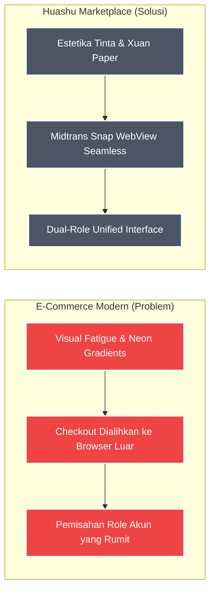

# DESAIN POSTER 1: Problem, Target User, & Kesesuaian Fitur

**Catatan untuk Desainer (Fathur Rohman):**
*Gunakan ukuran kanvas/kertas **A3 (29.7 x 42 cm)**. Desain poster ini difokuskan untuk memenuhi kriteria penilaian (Kejelasan Problem, Target User, Scope, dan Kesesuaian Fitur). Gunakan gaya desain tradisional minimalis yang elegan (Gaya Lukisan Cat Air / Xuan Paper, dengan kombinasi warna tenang abu-abu arang dan off-white). Semua teks di bawah ini dapat di-copy-paste langsung ke teks box di Canva/Figma.*

---

## [Bagian Header]
**Judul Besar:** Huashu Marketplace: E-Commerce Berestetika Lukisan Cat Air
**Sub-judul:** Ketenangan Kesenian Tradisional Tiongkok Dikombinasikan dengan Pembayaran FinTech Modern
**Oleh:** Ervareza Naurian, Adrianus Bagus, Fathur Rohman

---

## [Bagian Tengah - Elemen Visual Utama: Problem vs Solution]
*(Buat/gambar ulang diagram perbandingan ini dengan ilustrasi yang menarik di Canva/Figma)*

---

## [Bagian Kiri - Kejelasan Problem, Target User & Scope]

### Target Pengguna (User Persona)
Platform ini dibangun secara khusus untuk memberdayakan:
1. **Pecinta Seni & Kolektor Barang Unik (Customer)**
   Pengguna yang menghargai estetika visual tenang, minimalis, dan produk kerajinan bernilai seni tinggi.
2. **Pengrajin Tradisional & UMKM Seni (Seller)**
   Produsen lokal yang membutuhkan media katalog bernilai estetika tinggi untuk menjangkau pembeli premium.

### Latar Belakang Masalah (Pain Points)
- **Kelelahan Visual (Visual Fatigue):** Mayoritas marketplace dipenuhi warna neon agresif, bayangan tebal, iklan popup, dan desain AI tanpa karakter.
- **Alur Pembayaran Terputus:** Pengguna sering dialihkan ke browser eksternal saat checkout, sehingga rawan gagal bayar.
- **Pemisahan Akun Rumit:** Pengguna harus membuat akun terpisah untuk menjadi pembeli dan penjual di dalam satu platform.

### Batasan Sistem (Scope)
Sistem ini merupakan aplikasi e-commerce mobile berbasis Flutter dengan ruang lingkup:
- Modul autentikasi aman berbasis JWT (Token Lifecycle).
- Manajemen katalog produk (CRUD Seller & Catalog View Customer).
- Checkout instan menggunakan snap token Midtrans terintegrasi.
- Halaman kepatuhan penghapusan data pengguna mandiri (Data Safety).

---

## [Bagian Kanan - Kesesuaian Fitur dengan Problem]

### Bagaimana Fitur Menyelesaikan Masalah?
Fitur dalam Huashu Marketplace dirancang khusus untuk menjadi solusi langsung atas hambatan belanja online:

**1. Desain Estetika Huashu (Water-Ink)**
Mengatasi masalah *Visual Fatigue* dengan skema warna batu mineral tenang, garis pembatas tipis (0.5dp), dan tipografi serif klasik yang menyajikan ruang bernapas bagi mata pengguna.

**2. Midtrans Snap WebView Seamless**
Menyelesaikan isu checkout yang terputus. Kontainer webview disematkan secara internal dalam Flutter, mendeteksi status transaksi seketika, dan mengembalikan pengguna otomatis ke halaman konfirmasi setelah pembayaran berhasil.

**3. Dual-Role Unified Interface**
Menghilangkan kerumitan registrasi multi-akun. Melalui payload JWT, pembeli (`customer`) secara otomatis dapat mengakses menu pengelolaan produk penjual (*Seller Panel*) secara instan dalam satu akun terpadu.
