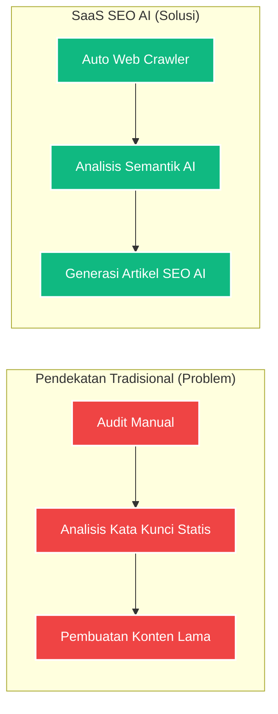

# DESAIN POSTER 1: Problem, Target User, & Kesesuaian Fitur

**Catatan untuk Desainer (Fathur Rohman):**
*Gunakan ukuran kanvas/kertas **A3 (29.7 x 42 cm)**. Desain poster ini difokuskan untuk memenuhi kriteria penilaian (Kejelasan Problem, Target User, Scope, dan Kesesuaian Fitur). Gunakan gaya desain modern SaaS (Warna Biru/Cyan dan Putih bersih). Semua teks di bawah ini dapat di-copy-paste langsung ke teks box di Canva/Figma.*

---

## [Bagian Header]
**Judul Besar:** SaaS SEO AI: Solusi Optimasi Konten Cerdas
**Sub-judul:** Mengatasi Inefisiensi Audit SEO dan Pembuatan Konten dengan Deepseek AI
**Oleh:** Ervareza Naurian, Adrianus Bagus, Fathur Rohman

---

## [Bagian Tengah - Elemen Visual Utama: Problem vs Solution]
*(Buat/gambar ulang diagram perbandingan ini dengan ilustrasi yang menarik di Canva/Figma)*

---

## [Bagian Kiri - Kejelasan Problem, Target User & Scope]

### Target Pengguna (User Persona)
Platform ini dibangun secara khusus untuk memberdayakan:
1. **Webmaster & Pengembang Web**
2. **Spesialis SEO & Digital Marketer**
3. **Pembuat Konten (Content Creator/Blogger)**

### Latar Belakang Masalah (Pain Points)
- **Memakan Waktu:** Audit SEO teknis secara manual pada ratusan halaman sangat tidak efisien.
- **Kurangnya Konteks Semantik:** Alat tradisional (konvensional) hanya mengecek metrik statis, tanpa pemahaman mendalam terhadap struktur bahasa.
- **Kesulitan Eksekusi:** Menemukan *keyword* bagus namun kesulitan merangkainya menjadi artikel yang *SEO-friendly*.

### Batasan Sistem (Scope)
Sistem ini merupakan platform *end-to-end* yang membatasi ruang lingkup pada:
- Manajemen proyek (berbasis URL website).
- Diagnostik otomatis (Crawler).
- Generasi teks berbasis AI yang diatur ketat (*Strict JSON Output*).

---

## [Bagian Kanan - Kesesuaian Fitur dengan Problem]

### Bagaimana Fitur Menyelesaikan Masalah?
Setiap fitur dalam platform SaaS SEO AI dibangun bukan sebagai *gimmick*, melainkan solusi langsung atas *pain points* pengguna:

**1. Diagnostik Crawler Instan**
Menjawab masalah audit manual dengan memindai URL target secara otomatis menggunakan `Cheerio`, mendeteksi struktur H1/H2, Meta Tags, dan kepadatan teks dalam hitungan detik.

**2. Rekomendasi Kata Kunci (Keyword Analysis)**
Menggunakan model bahasa untuk menilai *Search Intent* (Niat Pencarian) pengguna, bukan sekadar metrik volume standar. Membantu *marketer* menemukan celah persaingan (*low-hanging fruit*).

**3. Generasi Konten Terstruktur**
Sistem AI tidak sekadar menghasilkan teks bebas, melainkan **langsung memetakan** masalah dari hasil *Crawler* dan *Keyword* menjadi perbaikan artikel yang terstruktur rapi dan siap dipublikasikan.
