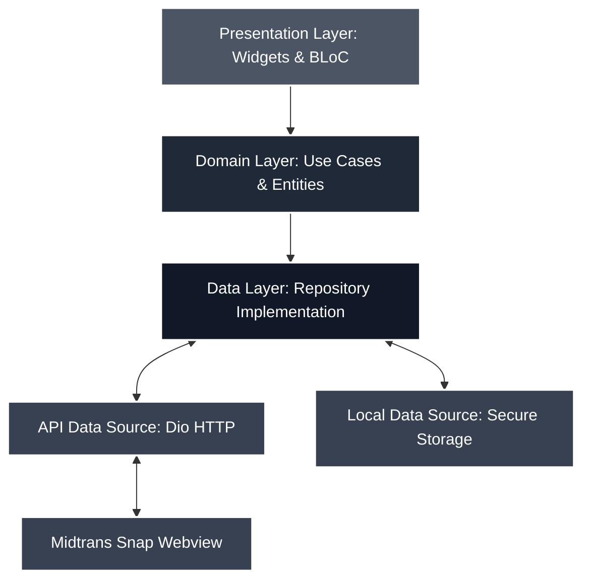

# DESAIN POSTER 2: Implementasi AI & Kualitas Engineering

**Catatan untuk Desainer (Fathur Rohman):**
*Gunakan ukuran kanvas/kertas **A3 (29.7 x 42 cm)**. Desain ini menonjolkan aspek teknis (Implementasi Flutter Clean Architecture, Security, dan Compliance) sesuai kriteria penilaian. Usahakan topologi arsitektur menjadi poin fokus utama (centerpiece). Desain harus terlihat bersih, elegan, dan profesional. Tabel paket/state dapat diberi warna pembeda.*

---

## [Bagian Header]
**Judul Besar:** Arsitektur FinTech E-Commerce & Keamanan Enkripsi
**Sub-judul:** Flutter Clean Architecture, Integrasi Webview Midtrans Snap, dan Kepatuhan Regulasi Google Play Store
**Oleh:** Ervareza Naurian, Adrianus Bagus, Fathur Rohman

---

## [Bagian Atas/Tengah - Kualitas Engineering: Arsitektur Sistem]

### Mengapa Memilih Flutter Clean Architecture?
Platform Huashu Marketplace mengadopsi standar arsitektur **Clean Architecture** untuk memastikan pemisahan tanggung jawab (*separation of concerns*) yang jelas antara presentasi UI, aturan bisnis, dan manajemen data:

---

## [Bagian Kiri - Integrasi Pembayaran & Flow Sesi]

### Manajemen Status Transaksi & Siklus Sesi JWT
*Aplikasi menjamin integritas data pesanan melalui webhook server-to-server Midtrans dan pemeliharaan token otomatis.*

| Status Transaksi | Aksi Sistem | Alur Pengguna |
| :--- | :--- | :--- |
| **Pending / Unpaid** | Simpan draf pesanan | Pengguna diarahkan ke internal Snap Webview |
| **Paid / Success** | Update status pesanan ke *Paid* | Redirect otomatis ke halaman konfirmasi pesanan |
| **Failed / Cancelled** | Kembalikan stok produk | Notifikasi gagal bayar & tombol coba lagi |

### Siklus Hidup Token JWT
- **Access Token:** Berumur 7 hari untuk autentikasi endpoint terlindungi.
- **Refresh Token:** Berumur 30 hari untuk perpanjangan otomatis di latar belakang (*silent token refresh*).

---

## [Bagian Kanan - Security, Maintainability & Compliance]

### Keamanan (Security) & Kepatuhan Regulasi (Compliance)
Sistem mematuhi standar keamanan modern dan kepatuhan toko aplikasi resmi:

1. **Enkripsi Kredensial Lokal:**
   Token JWT disimpan menggunakan enkripsi tingkat perangkat keras melalui **Flutter Secure Storage** (Keychain pada iOS dan AES-CBC dengan Android Keystore).

2. **Kepatuhan Data Safety Google Play Store:**
   Menyediakan halaman web mandiri **Permintaan Penghapusan Akun & Data** (`delete-account.html`) yang mendetailkan jenis data yang dihapus dan retensi 5 tahun untuk data transaksi keuangan (mematuhi regulasi pencucian uang).

3. **Kualitas & Standardisasi Kode:**
   - **Type-Safe Dart 3.x:** Menjamin keandalan penanganan tipe data dinamis.
   - **State Management BLoC:** Mengisolasi status UI secara absolut demi performa mulus **60-120 fps**.
