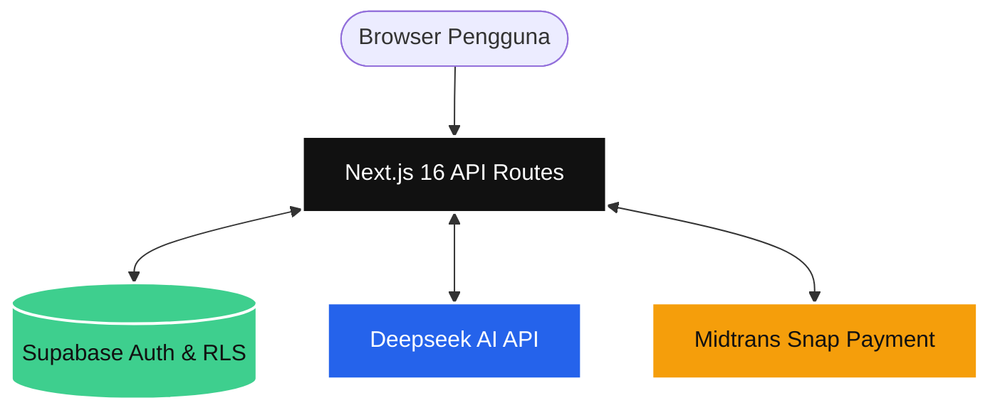

# DESAIN POSTER 2: Implementasi AI & Kualitas Engineering

**Catatan untuk Desainer (Fathur Rohman):**
*Gunakan ukuran kanvas/kertas **A3 (29.7 x 42 cm)**. Desain ini menonjolkan aspek teknis (Implementasi AI, Arsitektur, Security, dan Maintainability) sesuai kriteria penilaian. Usahakan topologi arsitektur menjadi poin fokus utama (centerpiece). Tabel paket dapat diberi warna pembeda.*

---

## [Bagian Header]
**Judul Besar:** Arsitektur Kelas Enterprise & Implementasi AI
**Sub-judul:** Rekayasa Prompt, Clean Architecture, dan Ketahanan Sistem (Reliability)
**Oleh:** Ervareza Naurian, Adrianus Bagus, Fathur Rohman

---

## [Bagian Atas/Tengah - Kualitas Engineering: Arsitektur Sistem]

### Mengapa Memilih Next.js 16 App Router?
Platform SaaS_SEO_AI mengadopsi standar web modern **Next.js 16 App Router** alih-alih menggunakan arsitektur Single Page Application (SPA) React tradisional (seperti CRA/Vite). Aplikasi memisahkan secara tegas antara *Client Components* (UI interaktif) dan *Server Components* (Pemrosesan data rahasia).

---

## [Bagian Kiri - Integrasi Pembayaran & Implementasi AI]

### Tabel Paket Berlangganan & Manajemen Limit (Midtrans)
*Platform mengatur lalu-lintas data secara efektif melalui mekanisme Token System berdasarkan tier pengguna.*
| Paket Langganan | Biaya Per Bulan | Bonus Token Awal | Kapasitas & Fitur Utama |
| :--- | :--- | :--- | :--- |
| **Free Plan** | Rp 0 | 0 | 1.000 Kata AI, 50 Keyword/bln, 1 Proyek |
| **Pro Plan** | Rp 750.000 | 25.000 Tokens | 50K Kata AI, 100 Scan URL, 3 Proyek |
| **Enterprise** | Rp 3.000.000 | 100.000 Tokens | AI & Scan Tak Terbatas, Custom Webhook API |

### Rekayasa Prompt & Fallback API
- **Structured JSON Prompting:** AI dipaksa mengembalikan struktur JSON baku, memastikan aplikasi tidak pernah *crash* akibat salah parsing teks paragraf.
- **Graceful Fallback:** Sistem menangkap error `429` (Rate Limit) dari Deepseek. Antarmuka tidak *hang*, melainkan mengamankan kuota/kredit pengguna agar tidak terpotong sia-sia.

---

## [Bagian Kanan - Security, Maintainability & Reproducibility]

### Keamanan (Security) Tingkat Lanjut
Sistem mematuhi standar *security* modern dengan lapisan pertahanan:
1. **Perlindungan Environment:** Variabel `.env` diproteksi absolut di sisi *Server* (Next.js Edge/Node).
2. **Sanitasi Data Webhook:** Memvalidasi payload *signature key* SHA-512 dari Midtrans.
3. **Row Level Security (RLS):** Supabase DB dikunci (hanya pemilik `auth.uid()` yang bisa melihat tagihan atau memanipulasi *Projects* miliknya sendiri).

### Kualitas & Standardisasi Kode
✅ **Tech Stack Modern:** Menggunakan ekosistem terbaru **React 19** dan **Tailwind CSS 4** untuk performa UI maksimal.
✅ **Static Testing & Type-Safe:** Kode dikawal ketat oleh **TypeScript 5** dan **ESLint**, meminimalisir *bug runtime* (menggantikan kebutuhan E2E konvensional).
✅ **Reproducibility:** Seluruh alur (Setup `.env.example`, perintah `npm install`, hingga struktur _database_) terdokumentasi rapi di folder `docs/`, menjamin dosen/penguji dapat me-*reproduce* sistem dengan cepat!
